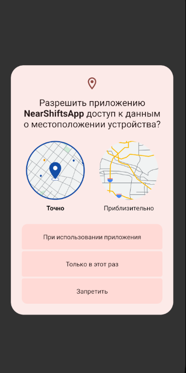
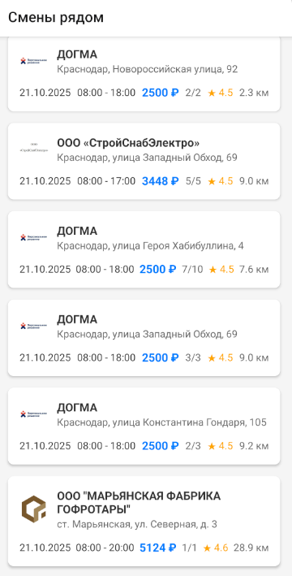

# NearShifts App

#Описание проекта

**NearShifts** — мобильное приложение для поиска ближайших смен работы с геолокацией. Приложение позволяет пользователям быстро находить актуальные вакансии в их районе с удобным интерфейсом и кешированием данных.

# Скриншоты приложения

<div align="center">

# Экран загрузки и геолокации


# Детали списка смен 


# Экран смена


# Экран фильтров


</div>

# Ключевые возможности

- **Геолокация**: Автоматическое определение местоположения пользователя при первом запуске
- **Умная сортировка**: Отображение смен отсортированных по расстоянию (алгоритм Haversine)
- **Кеширование данных**: Автоматическое сохранение данных в локальное хранилище для быстрого доступа
- **Pull-to-refresh**: Обновление данных жестом потягивания вниз
- **Поиск и фильтры**: Поиск по компаниям, адресам и типам работ с фильтрацией по цене и рейтингу
- **Темная тема**: Полная поддержка светлой, темной и системной темы с автоматическим сохранением
- **Детальная информация**: Полная информация о смене без повторных запросов к API
- **Адаптивный UI**: Современный интерфейс с поддержкой темной темы и анимаций
- **Обработка ошибок**: Грамотная обработка сетевых ошибок и отсутствия данных

# Подробное описание функций

## 🔍 Поиск и фильтры

**Поиск** позволяет быстро найти нужные смены по:
- Названию компании
- Адресу места работы
- Типам выполняемых работ

**Фильтры** включают:
- **Диапазон цен**: установка минимальной и максимальной оплаты за смену
- **Минимальный рейтинг**: фильтрация по рейтингу клиентов (1-5 звезд)
- **Сброс фильтров**: быстрое возвращение к полному списку

## 💾 Кеширование данных

- **Автоматическое сохранение**: данные сохраняются в локальное хранилище при загрузке
- **Быстрый доступ**: повторное открытие приложения показывает данные мгновенно
- **Срок действия**: кеш обновляется каждые 30 минут для актуальности информации
- **Автономная работа**: приложение работает даже без интернет-соединения

## 🔄 Pull-to-refresh

- **Жест обновления**: потяните список вниз для обновления данных
- **Визуальная индикация**: анимация загрузки во время обновления
- **Автоматическое кеширование**: свежие данные сохраняются в кеш

## 🌙 Темная тема

- **Три режима**: светлая, темная и системная (следует настройкам устройства)
- **Автоматическое сохранение**: выбранная тема сохраняется в памяти устройства
- **Быстрое переключение**: кнопка в заголовке для смены темы
- **Полная адаптация**: все элементы интерфейса адаптированы под выбранную тему

## 📍 Геолокация и сортировка

- **Автоматическое определение**: запрос геопозиции при первом запуске
- **Точная сортировка**: алгоритм Haversine для расчета расстояний
- **Отображение расстояния**: показ расстояния до каждой смены в карточке

# Стек технологий

| Framework                                                                                                 | Language                                                                                       | State Management                                                             | Navigation                                                                                                    | Permissions & Geo                                                                                                                                           | Storage & Caching                                                                                                      | UI & Styling                                                                                                      | Linting & Formatting                                                                                                                                                        | Testing                                                                                                                                                                                      |
| --------------------------------------------------------------------------------------------------------- | ---------------------------------------------------------------------------------------------- | ---------------------------------------------------------------------------- | ------------------------------------------------------------------------------------------------------------- | ----------------------------------------------------------------------------------------------------------------------------------------------------------- | ---------------------------------------------------------------------------------------------------------------------- | ----------------------------------------------------------------------------------------------------------------- | --------------------------------------------------------------------------------------------------------------------------------------------------------------------------- | -------------------------------------------------------------------------------------------------------------------------------------------------------------------------------------------- |
|  |  |  |  |   |   |   |   |   |


# Архитектура проекта

Проект построен с использованием современных архитектурных подходов:

- **Clean Architecture** — разделение на слои (UI, бизнес-логика, данные)
- **Feature-Sliced Design** — модульная организация кода по функциональным доменам
- **SOLID принципы** — для обеспечения качества и расширяемости кода
- **TypeScript** — строгая типизация всех компонентов и сервисов

# Структура проекта

```
src/
├── app/                    # Конфигурация приложения
│   ├── navigation/        # Навигация (React Navigation)
│   ├── providers/         # Провайдеры (MobX stores)
│   └── App.tsx           # Главный компонент приложения
├── components/            # Переиспользуемые UI компоненты
│   ├── UI/               # Базовые UI элементы
│   │   ├── Button.tsx    # Кнопка
│   │   ├── ErrorView.tsx # Отображение ошибок
│   │   ├── Rating.tsx    # Рейтинг
│   │   ├── Skeleton.tsx  # Заглушки загрузки
│   │   └── ThemeToggle.tsx # Переключатель темы
│   ├── SearchAndFilters.tsx # Поиск и фильтры
│   └── ShiftCard.tsx     # Карточка смены
├── screens/              # Экраны приложения
│   ├── ShiftListScreen.tsx    # Список смен с поиском и фильтрами
│   └── ShiftDetailsScreen.tsx # Детали смены
├── stores/               # MobX stores
│   ├── root.store.ts     # Корневой store
│   ├── shifts.store.ts   # Store управления сменами (с кешированием)
│   └── theme.store.ts    # Store управления темой
├── services/             # Бизнес-логика и API
│   ├── api.ts           # HTTP клиент
│   ├── location.ts      # Сервисы геолокации
│   └── distance.ts      # Расчет расстояний
├── types/               # TypeScript типы
├── lib/                 # Утилиты и хелперы
└── styles/              # Глобальные стили и тема
```

# Предварительные требования

Перед запуском убедитесь, что у вас установлены:

- **Node.js** >= 18.0.0
- **npm** или **yarn**
- **Android Studio** (для эмулятора Android)
- **JDK** 11+
- **Git**


# Установка и запуск

# 1. Клонирование репозитория

```bash
git clone <repository-url>
cd NearShiftsApp
```

# 2. Установка зависимостей

```bash
npm install
# или
yarn install
```

# 3. Установка iOS зависимостей (macOS)

```bash
cd ios
pod install
cd ..
```

# 4. Запуск на платформах

# Android

```bash
# Сборка и запуск на устройстве/эмуляторе
npx react-native run-android

# Альтернативно, запуск только Metro bundler
npm start
# В другом терминале
npx react-native run-android
```


# Тестирование

Проект включает полный набор тестов с покрытием > 80%:

# апуск всех тестов

```bash
# Запуск всех тестов
npm test

# Запуск с покрытием кода
npm run test:coverage

# Запуск конкретного тестового файла
npx jest src/components/__tests__/ShiftCard.test.tsx

# Запуск в режиме наблюдения
npm run test:watch
```

# Структура тестов

- **Unit тесты** — тестирование отдельных функций и компонентов
- **Integration тесты** — тестирование взаимодействия компонентов
- **E2E тесты** — сквозное тестирование пользовательских сценариев

# Конфигурация тестирования

Тесты настроены с использованием:
- **Jest** — тестовый раннер
- **React Native Testing Library** — утилиты для тестирования RN компонентов
- **Mock сервисы** — моки для внешних зависимостей


# Доступные команды

```bash
# Запуск приложения
npm start                 # Metro bundler
npm run android          # Android
npm run ios             # iOS

# Тестирование
npm test                # Все тесты
npm run test:watch      # Режим наблюдения
npm run test:coverage   # С покрытием

# Линтинг и форматирование
npm run lint            # Проверка кода
npm run lint:fix        # Автоисправление
npm run format          # Форматирование кода

# Сборка
npm run build:android   # APK для Android
npm run build:ios       # IPA для iOS
```

# Формат API ответа

```json
{
  "data": [
    {
      "id": "string",
      "logo": "string",
      "coordinates": {
        "longitude": "number",
        "latitude": "number"
      },
      "address": "string",
      "companyName": "string",
      "dateStartByCity": "string",
      "timeStartByCity": "string",
      "timeEndByCity": "string",
      "currentWorkers": "number",
      "planWorkers": "number",
      "workTypes": [
        {
          "id": "number",
          "name": "string",
          "nameGt5": "string",
          "nameLt5": "string",
          "nameOne": "string"
        }
      ],
      "priceWorker": "number",
      "bonusPriceWorker": "number",
      "customerFeedbacksCount": "string",
      "customerRating": "number | null",
      "isPromotionEnabled": "boolean"
    }
  ],
  "status": "number"
}
```

#  Контакты

- **Разработчик**: Юрий
- **Email**: Zakcoyote@gmail.com 
- **Telegram**: @Zak_Yuri

---

⭐ Если проект вам понравился, поставьте звезду!
